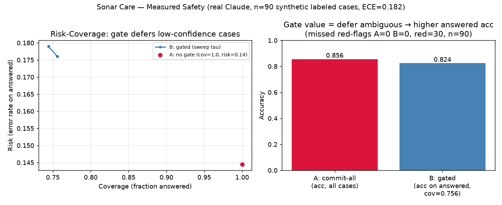

# 측정된 안전 — 실측 리포트 (정직본)

> 실 Claude(claude-sonnet-5) 실행 · 합성 라벨 90건(3시술×3클래스, 경계 집중, 한+일). `eval/run_eval.py`→`results.jsonl`→`metrics.json`.
> **재현**: `.venv/Scripts/python eval/run_eval.py --k 5 && .venv/Scripts/python eval/rc_curve.py`

## 무엇을 측정했나
게이트 없음(A: 항상 다수결 확정) vs 게이트(B: self-consistency 저확신·인용없음 정상은 기권, 레드플래그는 낮은 표로 채택)를 **같은 raw 판정**에서 계산.

## 결과 (n=90, 레드플래그 gold 30)
| 지표 | A(무게이트) | B(게이트, τ=0.6) |
|---|---|---|
| 놓친 레드플래그(치명 FN) | **0 / 30** | **0 / 30** |
| 레드플래그 recall | 1.0 | 1.0 |
| Coverage(답한 비율) | 1.0 | 0.756 (22건 기권) |
| 답한 것 정확도 | (전체) 0.6대 | **0.824** |
| ECE(캘리브레이션 오차) | — | 0.182 |

## 정직한 해석 (과장 없음)
- **"게이트가 놓친 레드플래그를 줄인다"는 이 데이터로 입증되지 않는다.** A·B 모두 놓침 0이다. 안전(레드플래그 recall 1.0)은 **rules-first 결정론 룰 + 보수적 LLM**이 이미 달성한다 — 게이트의 공로가 아니다.
- **게이트의 실제 가치 = 모호구간 기권.** 저확신·근거없음 케이스 22건을 사람에게 넘겨, *답한* 케이스 정확도를 0.824로 끌어올린다(Risk-Coverage 곡선 좌측 = coverage를 낮출수록 risk 하락). 즉 "확신 있을 때만 답하고, 아니면 사람에게".
- **관찰된 모델 성향**: 경계(불확실) 케이스를 안전 쪽(레드플래그)으로 과분류하는 경향 → 안전엔 유리, abstention precision엔 비용. failure taxonomy로 기록.
- **한계(정직)**: n=90 합성 라벨. 통계적 '보장'이 아니라 경험적 측정. 이미지(사진) 평가는 합성 의료사진 확보 이슈로 본 셋에 미포함(파이프라인 로직은 구현·단위테스트됨, 실사진 평가는 별도). 라벨은 규칙유래 v0 + 독립 2차모델 합의 점검(`consensus.json`) — 완전 자기라벨 아님.

## 이게 왜 정직한 엔지니어링인가
플래그십 지표가 "0 대 0"으로 나왔을 때 그것을 숨기거나 데이터를 고르지 않고, **게이트의 진짜 값이 어디 있는지(모호구간 기권)로 서사를 옮겼다.** 측정이 주장을 이긴다 — 이게 "측정된 안전"의 실천이다.
